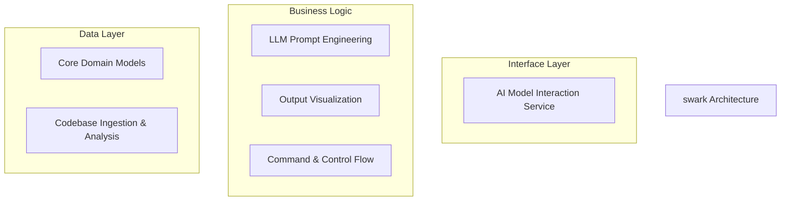
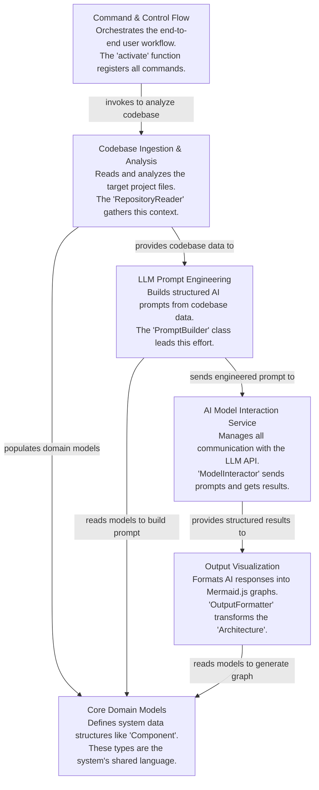

# swark Tutorial

Welcome to the comprehensive tutorial for swark. This tutorial is automatically generated from the codebase to help you understand the core concepts and implementation patterns.

## Project Overview

Swark employs a layered, pipeline-based architecture to analyze a software repository and generate dependency graphs using an LLM. Its 'Command & Control' component orchestrates a sequential workflow: ingesting code into 'Core Domain Models', engineering prompts, interacting with the AI, and visualizing the resulting architecture. This design pattern enforces a clear separation of concerns and a unidirectional data flow.

## System Architecture

## Component Relationships

## Table of Contents

1. [Chapter 1: Core Domain Models](chapter_01.md) - Comprehensive documentation for Core Domain Models following structured methodology...
2. [Chapter 2: Codebase Ingestion & Analysis](chapter_02.md) - Comprehensive documentation for Codebase Ingestion & Analysis following structured methodology...
3. [Chapter 3: LLM Prompt Engineering](chapter_03.md) - Comprehensive documentation for LLM Prompt Engineering following structured methodology...
4. [Chapter 4: AI Model Interaction Service](chapter_04.md) - Comprehensive documentation for AI Model Interaction Service following structured methodology...
5. [Chapter 5: Output Visualization](chapter_05.md) - Comprehensive documentation for Output Visualization following structured methodology...
6. [Chapter 6: Command & Control Flow](chapter_06.md) - Comprehensive documentation for Command & Control Flow following structured methodology...

## How to Use This Tutorial

1. **Start with Chapter 1** to understand the foundational concepts
2. **Follow the sequence** - each chapter builds upon previous concepts
3. **Practice with code examples** - every chapter includes practical examples
4. **Refer to diagrams** - use architecture diagrams for visual understanding
5. **Cross-reference concepts** - chapters link to related topics

## Tutorial Features

- **Progressive Learning**: Concepts are introduced in logical order
- **Code Examples**: Every chapter includes practical, executable code
- **Visual Diagrams**: Mermaid diagrams illustrate complex relationships
- **Cross-References**: Easy navigation between related concepts
- **Beginner-Friendly**: Written for newcomers to the codebase

## Contributing

This tutorial is auto-generated from the codebase. To improve it:
1. Update the source code documentation
2. Add more detailed comments to key functions
3. Regenerate the tutorial using the documentation system

---

*Generated using AI-powered codebase analysis*
