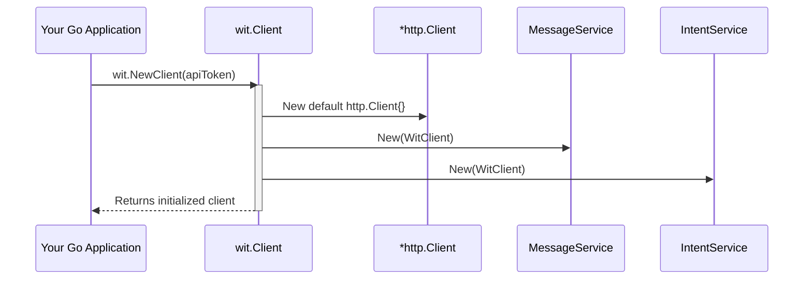

# Chapter 1: Wit.ai Client

Welcome to the 'wit-go' project documentation! This first chapter introduces you to the foundational component: the `Wit.ai Client`. As the entry point for all interactions with the Wit.ai API, understanding its purpose and usage is crucial for building any application with `wit-go`.

---

### Problem & Motivation

Integrating with external APIs like Wit.ai often presents several challenges for developers. You typically need to:
1.  **Handle HTTP requests**: Constructing URLs, setting headers, choosing the right HTTP method (GET, POST).
2.  **Manage authentication**: Securely storing and sending API tokens with every request.
3.  **Parse responses**: Decoding JSON data into Go structs, handling potential errors from the API.
4.  **Abstract complexity**: Dealing with different API endpoints for various services (NLU, STT, entity management, etc.).

Without a dedicated client library, developers would spend significant time writing boilerplate code, increasing the risk of errors and slowing down development. The core problem is the *friction* involved in connecting a Go application to a powerful AI service like Wit.ai.

The `wit-go` project solves this by providing an official Go client library. The `Wit.ai Client` abstraction is central to this solution, offering a streamlined, Go-idiomatic way to interact with Wit.ai. Imagine you want to quickly add natural language understanding (NLU) to a simple Go chatbot. Instead of manually crafting HTTP requests to Wit.ai's `/message` endpoint, the `Wit.ai Client` allows you to simply call a method like `client.Message.Extract("hello world")` and receive parsed NLU data directly in Go structs. This significantly speeds up development and reduces the learning curve for integrating advanced NLU capabilities.

---

### Core Concept Explanation

At its heart, the `Wit.ai Client` (represented by the `wit.Client` struct in `wit-go`) is your application's **gateway to the Wit.ai API**. Think of it as a specialized remote control that understands all the different functions and capabilities of your Wit.ai application.

It encapsulates the essential elements needed to communicate with Wit.ai:
*   **Authentication**: It securely holds your Wit.ai API token, ensuring that all requests made through it are properly authorized. Without this token, Wit.ai cannot identify your application or access your training data.
*   **Endpoint Access**: It provides structured access to various Wit.ai services through dedicated sub-clients, such as `Client.Message` for NLU, `Client.Intent` for managing intents, and so on. This modular design keeps the API organized and easy to navigate.
*   **HTTP Communication**: Internally, it manages the underlying HTTP requests and responses, abstracting away the complexities of `net/http`. This means you don't have to worry about low-level network details; you just call Go methods.

The `wit.Client` is the *first object* you need to create when using `wit-go`. It initializes the connection parameters and makes subsequent API calls much simpler. For instance, to process a user's utterance for NLU, you don't interact directly with Wit.ai's `/message` endpoint; instead, you use the `Message` sub-client provided by the `wit.Client`. This structured approach ensures consistency, simplifies error handling, and promotes cleaner code.

---

### Practical Usage Examples

Let's dive into how to create and use the `Wit.ai Client` to solve our motivating use case: quickly processing a user message for NLU.

First, you need a Wit.ai API token. You can find this in your Wit.ai application settings. For security, it's best practice to load this from an environment variable.

#### 1. Importing the Library

To begin, import the `wit-go` package in your Go application:

```go
package main

import (
	"fmt"
	"os"

	wit "github.com/wit-ai/wit-go" // Standard import for wit-go
)
```
*Explanation*: This imports the necessary package, typically aliased as `wit` for brevity.

#### 2. Creating a New Wit.ai Client

Instantiate the `wit.Client` using the `wit.NewClient` function, passing your API token.

```go
func main() {
	// Retrieve your Wit.ai API token from an environment variable
	apiToken := os.Getenv("WIT_AI_ACCESS_TOKEN")
	if apiToken == "" {
		fmt.Println("Error: WIT_AI_ACCESS_TOKEN environment variable not set.")
		os.Exit(1)
	}

	// Create a new Wit.ai client
	client := wit.NewClient(apiToken)
	fmt.Println("Wit.ai client created successfully!")
}
```
*Explanation*: The `wit.NewClient()` function takes your API token and returns an initialized `wit.Client` instance. It's crucial to handle cases where the token might be missing.

#### 3. Processing a Message (NLU)

Now that we have a client, we can use its `Message` sub-client to process a text input, which is our motivating use case for NLU.

```go
func main() {
	// ... (client creation code from above) ...

	// Send a message for NLU processing
	message, err := client.Message.Extract("What's the weather like in Paris?")
	if err != nil {
		fmt.Printf("Error processing message: %v\n", err)
		return
	}

	// Print the NLU response
	fmt.Println("NLU Response:")
	fmt.Printf("  Text: %s\n", message.Text)
	fmt.Printf("  Intent: %s\n", message.Intents[0].Name)
	// Output will vary based on your Wit.ai app's training
}
```
*Explanation*: `client.Message.Extract()` sends the text "What's the weather like in Paris?" to Wit.ai. If successful, it returns a `wit.MessageResponse` struct containing the NLU results, including detected intents and entities. The example then prints the text and the name of the top intent.

This sequence demonstrates how easily `wit-go` allows you to integrate complex NLU features into your application with just a few lines of code, thanks to the `wit.Client` abstraction.

---

### Internal Implementation Walkthrough

The `wit.Client` is relatively straightforward in its internal structure, but it's the foundation upon which all other API interactions are built.

At its core, the `wit.Client` struct (defined in `client.go`) looks something like this:

```go
// Simplified view of the wit.Client struct
type Client struct {
	APIToken    string
	HTTPClient  *http.Client
	BaseURL     string

	Message *MessageService
	Intent  *IntentService
	// ... other services
}
```

#### 1. Initialization (`wit.NewClient`)

When you call `wit.NewClient(apiToken string)`, the following steps occur:
*   A new `wit.Client` instance is created.
*   The provided `apiToken` is stored in the `APIToken` field.
*   A default `*http.Client` (from Go's standard `net/http` package) is initialized and assigned to the `HTTPClient` field. This client is responsible for making all network requests.
*   The `BaseURL` for Wit.ai (e.g., `https://api.wit.ai`) is set.
*   Crucially, all the service clients (`MessageService`, `IntentService`, etc.) are initialized and attached to the `Client` instance. These services are pointers to structs that know how to interact with specific Wit.ai API endpoints, and they share the parent `wit.Client`'s `APIToken` and `HTTPClient`.


*Explanation*: This diagram shows how your application creates the `wit.Client`, which in turn sets up the underlying HTTP client and initializes its specialized service components (`MessageService`, `IntentService`, etc.), making them ready for use.

#### 2. Making an API Call (e.g., `Client.Message.Extract`)

When you call a method like `client.Message.Extract("text")`:
*   The `Extract` method, belonging to the `MessageService`, is invoked.
*   Internally, the `MessageService` uses the `APIToken` and `HTTPClient` it inherited from the `wit.Client`.
*   It constructs the appropriate HTTP request (e.g., `GET /message?v=20230215&q=text`).
*   It adds the `Authorization` header with the `APIToken`.
*   It uses the shared `HTTPClient` to send the request to the Wit.ai API.
*   Upon receiving a response, it handles parsing the JSON into the relevant Go struct (`wit.MessageResponse`) and checks for API errors.
*   Finally, it returns the parsed data or an error back to your application.

This design ensures that all API calls are routed through a single, well-configured client, simplifying error handling, authentication, and connection management.

---

### System Integration

The `wit.Client` is the **root** of the `wit-go` library's structure. Every other major component and feature in 'wit-go' integrates directly with or depends on an instance of `wit.Client`.

*   **Service Abstraction**: The `wit.Client` provides access to distinct service managers:
    *   `client.Message`: For [Message Processing (NLU)](chapter_03.md).
    *   `client.Intent`: For [Intent Management](chapter_04.md).
    *   `client.Entity`: For [Entity Management](chapter_05.md).
    *   `client.Utterance`: For [Utterance Management](chapter_06.md).
    *   `client.Speech`: For [Dictation (Speech-to-Text)](chapter_07.md).
Each of these "sub-clients" is initialized with a reference to the main `wit.Client`'s `APIToken` and `HTTPClient`, allowing them to make authorized requests efficiently.

*   **Standard Go `net/http`**: The library leverages Go's robust `net/http` package for all network communication. This means developers familiar with Go's standard library will find the underlying mechanisms intuitive.
*   **Error Handling**: The `wit.Client` and its services are designed to return standard Go `error` types, allowing for consistent error handling throughout your application.

Data flow generally originates from your application, passes through a `wit.Client` method, makes an HTTP request to Wit.ai, receives a response, which is then unmarshaled into Go structs and returned to your application. This centralized communication hub simplifies debugging and ensures consistent behavior across all API interactions.

---

### Best Practices & Tips

To get the most out of the `Wit.ai Client` and ensure your application is robust and secure, consider these best practices:

*   **API Token Security**: Never hardcode your Wit.ai API token directly into your source code. Instead, load it from environment variables (e.g., `WIT_AI_ACCESS_TOKEN`), a configuration file, or a secure secret management system. This prevents accidental exposure and allows easy configuration across different environments.
*   **Client Reuse**: Create a single instance of `wit.Client` when your application starts and reuse it for all subsequent API calls. Do *not* create a new `wit.Client` for every request. Creating a new client repeatedly can lead to resource exhaustion and degraded performance, as each client might initialize its own HTTP client and connections.
*   **Robust Error Handling**: Always check the `error` return value from `wit-go` functions. Wit.ai's API might return errors due to various reasons (invalid input, rate limiting, internal server issues). Implement proper error logging and graceful degradation in your application.
*   **Consider Context for Requests**: For longer-running applications or those sensitive to timeouts, you can customize the underlying `*http.Client` that `wit-go` uses, especially for setting timeouts or using context for cancellation. We'll explore this more in the next chapter.

---

### Chapter Conclusion

The `Wit.ai Client` is the cornerstone of the `wit-go` library. You've learned that it acts as the primary interface for your Go applications to interact with the Wit.ai API, simplifying authentication, request handling, and response parsing. We've walked through its core concept, seen practical examples of how to instantiate and use it for NLU, and briefly looked into its internal workings and integration with other parts of the system.

By understanding the `wit.Client`, you now have the fundamental knowledge to begin building powerful AI-driven features into your Go applications. In the next chapter, we will delve into the various [Client Configuration Options](chapter_02.md) available, allowing you to fine-tune the client's behavior for specific needs, such as setting custom HTTP clients, timeouts, or proxies.