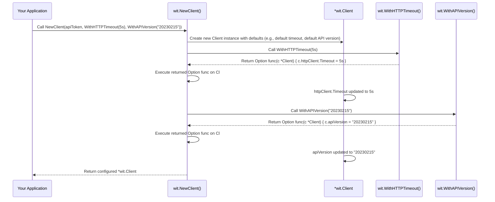

# Chapter 2: Client Configuration Options

In the [previous chapter on the Wit.ai Client](chapter_01.md), we learned how to instantiate the core `wit-go` client, which serves as our primary gateway to the Wit.ai API. We saw how crucial the API token is for authentication, providing the client with the necessary credentials to interact with Wit.ai's services. While initializing the client with just an API token is sufficient for basic operations, real-world applications often require more control over how the client behaves.

---

### Problem & Motivation

Imagine building an application that relies heavily on Wit.ai for natural language understanding (NLU). Your users might be on various network conditions, or perhaps your application needs to strictly adhere to performance budgets. What if the default network timeout for API requests is too long, causing your application to appear unresponsive during temporary network glitches? Or what if Wit.ai introduces a new API version with features you want to leverage, but the `wit-go` client defaults to an older version?

This is where client configuration options become essential. The problem they solve is the rigidity of a "one-size-fits-all" client. Without them, you'd be stuck with predefined behaviors, making it challenging to adapt to specific operational environments, optimize performance, or integrate with evolving API standards. For instance, if you're running `wit-go` in a serverless function with a strict execution time limit, a long default timeout could lead to costly function timeouts. Our goal is to empower developers to tailor the `wit-go` client's behavior precisely to their application's needs, such as setting a custom timeout of 5 seconds to ensure quick failure detection and better resource management.

---

### Core Concept Explanation

Client configuration options in `wit-go` provide a flexible and extensible way to customize the client's behavior during its initialization. Instead of passing many parameters to a constructor (which can become unwieldy), `wit-go` leverages a common Go pattern known as "functional options." This pattern involves defining a type, typically a function, that takes a pointer to the client struct and modifies its properties.

At its heart, a configuration option is a simple function. When you create a new `WitClient`, you can pass one or more of these option functions. Each option function is then called by the client's constructor, allowing it to modify internal settings like the HTTP client's timeout, the target Wit.ai API version, or custom HTTP headers. This design keeps the `NewClient` function clean and allows for adding new configuration options without changing its signature, promoting excellent backward compatibility and extensibility. Key terms here include *functional options*, which are functions that configure an object, and *variadic arguments*, which allow us to pass zero or more options to the client constructor.

---

### Practical Usage Examples

Let's explore how to apply these configuration options to solve our motivating use case: setting a custom request timeout.

#### 1. Initializing with Default Options

First, let's see how we initialize the client without any explicit options. It uses all the default settings, including the default HTTP timeout.

```go
package main

import (
	"log"
	"os"

	witai "github.com/wit-ai/wit-go/wit"
)

func main() {
	// Get API token from environment variable
	apiToken := os.Getenv("WIT_AI_API_TOKEN")
	if apiToken == "" {
		log.Fatal("WIT_AI_API_TOKEN environment variable not set")
	}

	// Initialize client with default settings
	client := witai.NewClient(apiToken)
	log.Println("Client initialized with default configuration.")
	// The client is now ready to use with Wit.ai's default HTTP timeout (e.g., 30s)
}
```
*Explanation*: We import the `wit-go` library and `log` for output. We retrieve the `WIT_AI_API_TOKEN` from environment variables, which is a best practice for handling sensitive information. Then, we create a new client using `witai.NewClient(apiToken)`. Since we provide no additional arguments, the client will use all its default internal settings, including the standard HTTP request timeout.

#### 2. Setting a Custom Request Timeout

Now, let's configure the client with a specific timeout of 5 seconds. This is crucial for applications where quick failure detection is preferred over waiting for very slow responses.

```go
package main

import (
	"log"
	"os"
	"time"

	witai "github.com/wit-ai/wit-go/wit"
)

func main() {
	apiToken := os.Getenv("WIT_AI_API_TOKEN")
	if apiToken == "" {
		log.Fatal("WIT_AI_API_TOKEN environment variable not set")
	}

	// Initialize client with a 5-second timeout
	client := witai.NewClient(apiToken, witai.WithHTTPTimeout(5*time.Second))
	log.Println("Client initialized with a 5-second HTTP timeout.")
	// All subsequent HTTP requests made by this client will respect the 5s timeout.
}
```
*Explanation*: Here, we pass `witai.WithHTTPTimeout(5*time.Second)` as a second argument to `NewClient`. `WithHTTPTimeout` is a functional option provided by the `wit-go` library. It takes a `time.Duration` and returns a function that configures the client's internal HTTP client with the specified timeout.

#### 3. Specifying a Different API Version

Wit.ai APIs can evolve, and you might need to target a specific version. For example, if you want to use a `20230215` API version instead of the default.

```go
package main

import (
	"log"
	"os"

	witai "github.com/wit-ai/wit-go/wit"
)

func main() {
	apiToken := os.Getenv("WIT_AI_API_TOKEN")
	// ... error handling ...

	// Initialize client targeting a specific API version
	client := witai.NewClient(apiToken, witai.WithAPIVersion("20230215"))
	log.Println("Client initialized to use API Version '20230215'.")
	// All requests will now include the Wit-Version header for this specific date.
}
```
*Explanation*: The `witai.WithAPIVersion` option allows you to override the default Wit.ai API version used in the `Wit-Version` HTTP header for all requests made by this client. This is useful for compatibility or accessing newer features.

#### 4. Combining Multiple Configuration Options

You can easily combine multiple options to configure various aspects of the client simultaneously.

```go
package main

import (
	"log"
	"os"
	"time"

	witai "github.com/wit-ai/wit-go/wit"
)

func main() {
	apiToken := os.Getenv("WIT_AI_API_TOKEN")
	// ... error handling ...

	// Initialize client with custom timeout AND API version
	client := witai.NewClient(
		apiToken,
		witai.WithHTTPTimeout(10*time.Second),
		witai.WithAPIVersion("20230215"),
	)
	log.Println("Client initialized with 10-second timeout and API Version '20230215'.")
}
```
*Explanation*: Here, we pass two functional options to `NewClient`. The `wit-go` library will apply both configurations sequentially during the client's creation, resulting in a client instance tailored with both a custom timeout and a specific API version.

---

### Internal Implementation Walkthrough

The `wit-go` client implements configuration using the functional options pattern, which is a powerful way to manage optional parameters in Go. Let's trace how this works within the `wit.NewClient` function.

1.  **`NewClient` Signature**: The `NewClient` function is the entry point. Its signature looks something like this:
    ```go
    // wit/client.go
    func NewClient(apiToken string, options ...Option) *Client {
        // ...
    }
    ```
    Notice `options ...Option`. This is a *variadic parameter*, meaning `NewClient` can accept zero or more arguments of type `Option`.

2.  **The `Option` Type**: `Option` is an interface or a function type (in `wit-go`, it's likely a function type) that defines how a configuration function should look.
    ```go
    // wit/client.go
    type Option func(*Client)
    ```
    This means any function that takes a pointer to a `Client` struct and returns nothing can be an `Option`.

3.  **Default Client Creation**: Inside `NewClient`, the first step is to create a `Client` struct with sensible default values.
    ```go
    // wit/client.go (simplified)
    func NewClient(apiToken string, options ...Option) *Client {
        c := &Client{
            token: apiToken,
            // default HTTP client with a standard timeout (e.g., 30s)
            httpClient: &http.Client{
                Timeout: 30 * time.Second, // Default timeout
            },
            apiVersion: "20230215", // Default API version
        }
        // ...
        return c
    }
    ```
    At this point, `c` is a fully functional client, but it uses all default settings.

4.  **Applying Options**: Next, `NewClient` iterates through the `options` slice (if any were provided) and calls each `Option` function, passing the newly created `c` client instance to it.
    ```go
    // wit/client.go (simplified)
    func NewClient(apiToken string, options ...Option) *Client {
        c := &Client{ /* ... default initialization ... */ }

        // Apply each provided option to the client
        for _, option := range options {
            option(c) // This calls the function, modifying 'c'
        }

        return c
    }
    ```

5.  **How an `Option` Function Works**: Let's look at `WithHTTPTimeout`.
    ```go
    // wit/options.go (simplified)
    func WithHTTPTimeout(timeout time.Duration) Option {
        return func(c *Client) {
            c.httpClient.Timeout = timeout // This modifies the client's HTTP client
        }
    }
    ```
    When you call `witai.WithHTTPTimeout(5*time.Second)`, it *returns* a function of type `Option`. This returned function is then executed by `NewClient`, and it modifies the `Timeout` field of the `Client`'s internal `http.Client`.

Here's a simplified sequence diagram illustrating the flow:



---

### System Integration

Client configuration options are fundamental because they directly influence how the `WitClient` interacts with the external Wit.ai API. These settings are applied at the very core of the client's operations and affect all subsequent calls to other parts of the `wit-go` library.

*   **Impact on [Message Processing (NLU)](chapter_03.md)**: When you use the client to send a message for NLU, the configured `http.Client` (with its timeout) will be used to make the underlying HTTP request. Similarly, the `apiVersion` will be included in the `Wit-Version` header for that request. If your timeout is too short, NLU requests might time out before Wit.ai can respond, leading to errors. If the `apiVersion` is incorrect, Wit.ai might reject the request or provide responses in an unexpected format.

*   **Impact on [Intent Management](chapter_04.md) / [Entity Management](chapter_05.md) / [Utterance Management](chapter_06.md)**: All administrative API calls (creating/updating intents, entities, utterances) also rely on the client's internal HTTP client and API version settings. Consistent behavior across all API interactions is ensured by configuring the client once at initialization.

*   **Impact on [Dictation (Speech-to-Text)](chapter_07.md)**: For speech-to-text functionality, which often involves streaming data or potentially longer processing times, the `WithHTTPTimeout` option can be especially critical. You might need a more generous timeout for dictation compared to simple NLU requests to allow for audio upload and processing.

Essentially, the configuration options establish the communication contract and reliability parameters between your Go application and the Wit.ai backend. They are applied once during `NewClient` and then govern the behavior of the entire `WitClient` instance for its lifetime.

---

### Best Practices & Tips

*   **Use Environment Variables for API Tokens**: Always load your `WIT_AI_API_TOKEN` from environment variables, not directly embedding it in your code. This is a crucial security practice.
*   **Sensible Timeouts**: Choose `WithHTTPTimeout` values wisely. Too short, and you might get false positives for network issues; too long, and your application might hang. Consider the typical response times of Wit.ai and your application's tolerance for latency. For serverless environments, match the timeout to your function's maximum execution time.
*   **Specific API Versions**: While `wit-go` aims for backward compatibility, explicitly setting `WithAPIVersion` can prevent unexpected behavior if Wit.ai introduces breaking changes in newer versions or if you need to access features only available in a specific version.
*   **Custom Options (Advanced)**: For advanced use cases, you can define your own functional options if the built-in ones don't cover your needs. For example, if you wanted to inject a custom `http.RoundTripper` for request logging or retry logic.
    ```go
    // wit/client.go (example of a custom option you might write)
    func WithCustomLogger(logger *log.Logger) witai.Option {
        return func(c *witai.Client) {
            // This assumes `Client` has a field to store a custom logger
            // Or you could wrap the http.Client's RoundTripper
            // For simplicity, let's assume `Client` has a `Logger` field
            // c.Logger = logger
            log.Println("Note: This is an example of a custom option. The actual WitClient may not support this directly without internal changes.")
        }
    }
    ```
    This demonstrates the power of the functional options pattern: it's highly extensible without modifying the `NewClient` signature.
*   **Avoid Global Client Instances (Mostly)**: While tempting, avoid creating a single global `WitClient` instance if your application has vastly different configuration needs across different parts. Instead, create separate client instances with tailored configurations where appropriate.

---

### Chapter Conclusion

In this chapter, we've explored the power and flexibility of client configuration options in `wit-go`. We learned why these options are critical for tailoring the `WitClient` to specific application requirements, addressing issues like network latency and API versioning. We saw practical examples of setting custom timeouts and API versions, and delved into the internal mechanics of how `wit-go` uses the functional options pattern to achieve this extensibility. Understanding these concepts allows you to build more robust, performant, and adaptable applications that interact seamlessly with the Wit.ai API.

With our client now properly configured, we are ready to put it to work! The next step is to leverage its core capabilities for understanding natural language. We will dive into how to send user messages to Wit.ai and interpret the NLU results.

Proceed to [Message Processing (NLU)](chapter_03.md) to learn how to make your application understand human language.