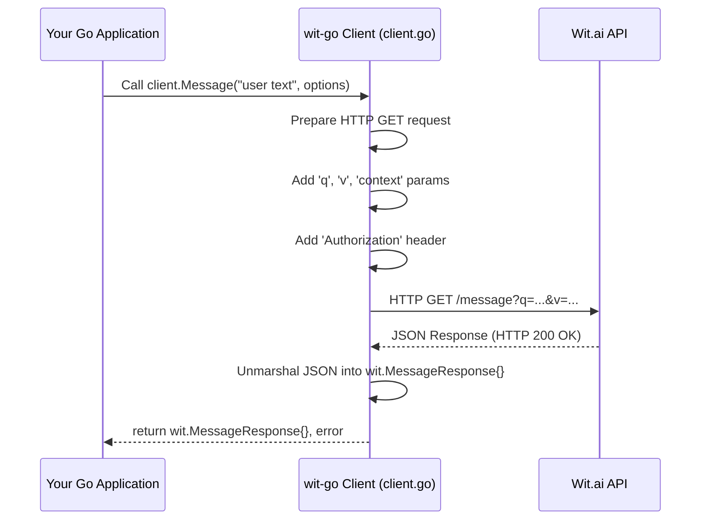

# Chapter 3: Message Processing (NLU)

Welcome back! In the [previous chapter](chapter_02.md), we explored how to configure our `wit-go` client to tailor its behavior, setting options like request timeouts and API versions. With our client now robustly configured, it's time to put it to its primary use: understanding what users say.

---

### Problem & Motivation

Imagine building an application that needs to respond intelligently to human input. Whether it's a voice assistant, a smart home controller, or a chatbot, users communicate in natural language. The raw text or audio they provide, however, is just a sequence of words or sounds. How does an application discern the *meaning* or *intention* behind "turn off the lights in the living room"?

This is the core problem that Natural Language Understanding (NLU) solves. Without NLU, applications are limited to keyword matching or rigid command structures, leading to frustrating user experiences. In the `wit-go` project, **Message Processing (NLU)** is the critical bridge that transforms unstructured human language into structured, actionable data. It empowers your Go application to understand user requests, identify key information, and respond appropriately.

For instance, our smart home application needs to process "turn off the lights in the living room." It's not enough to just detect "lights"; it must understand the *intent* to "turn off" and recognize "living room" as a specific *location*. This chapter will guide you through using `wit-go` to achieve exactly this, making your applications truly conversational.

---

### Core Concept Explanation

Natural Language Understanding (NLU) is the process by which a computer system derives meaning from human language. When you send a message to Wit.ai through `wit-go`, its NLU engine goes to work, much like a highly skilled interpreter and data extractor. It analyzes the input and outputs a structured JSON object containing its understanding of the message.

The key components Wit.ai extracts from your messages are:

*   **Intents**: These represent the primary goal or purpose of the user's utterance. For "turn off the lights," the intent might be `toggle_appliance`. An intent tells your application *what* the user wants to do.
*   **Entities**: These are specific, relevant pieces of information mentioned in the utterance. In our example, "lights" could be an `appliance` entity, and "living room" a `location` entity. Entities provide the *details* needed to fulfill the intent. Wit.ai provides built-in entities (e.g., `wit/on_off`, `wit/location`) and allows you to define custom ones.
*   **Traits**: These are contextual characteristics or modifiers of the utterance, often representing simple true/false or categorical values. For "turn off," Wit.ai might detect the `wit/on_off` trait with a value of `off`. Traits can refine the understanding of intents or entities.

The `wit-go` library simplifies this by handling the communication with the Wit.ai API, allowing you to focus on consuming the rich NLU results. It translates your request into the appropriate API call and then marshals the Wit.ai JSON response into convenient Go structs, making it straightforward to access intents, entities, and traits.

---

### Practical Usage Examples

Let's use our smart home scenario: "turn off the lights in the living room." We'll see how `wit-go` helps us understand this command.

First, ensure you have a Wit.ai client initialized. You'll need your Wit.ai server access token.

```go
package main

import (
	"context"
	"fmt"
	"log"
	"os"

	"github.com/wit-ai/wit-go/v2/wit"
)

func main() {
	// Initialize the Wit.ai client using your server access token.
	// It's best practice to load this from an environment variable.
	client := wit.NewClient(os.Getenv("WIT_AI_SERVER_ACCESS_TOKEN"))
	if client == nil {
		log.Fatalf("Failed to initialize Wit.ai client. Ensure WIT_AI_SERVER_ACCESS_TOKEN is set.")
	}

	// Define the user's message
	userMessage := "turn off the lights in the living room"
	fmt.Printf("Processing message: '%s'\n", userMessage)

	// Send the message for NLU processing
	// The context.Background() is used here for simplicity.
	// In a real application, you might use a request-scoped context.
	msgResponse, err := client.Message(context.Background(), userMessage, nil)
	if err != nil {
		log.Fatalf("Error processing message: %v", err)
	}

	// Print the raw message response
	fmt.Printf("Raw Wit.ai Response: %+v\n", msgResponse)
}
```
This initial example demonstrates how to send a text message to Wit.ai using the `client.Message()` function. It takes the `context.Context`, the user's string message, and optional `wit.MessageOptions`. The result is a `wit.MessageResponse` struct containing Wit.ai's NLU output.

Now, let's extract the intent and relevant entities from the `msgResponse`.

```go
package main

import (
	"context"
	"fmt"
	"log"
	"os"

	"github.com/wit-ai/wit-go/v2/wit"
)

func main() {
	client := wit.NewClient(os.Getenv("WIT_AI_SERVER_ACCESS_TOKEN"))
	if client == nil {
		log.Fatalf("Failed to initialize Wit.ai client.")
	}
	userMessage := "turn off the lights in the living room"

	msgResponse, err := client.Message(context.Background(), userMessage, nil)
	if err != nil {
		log.Fatalf("Error processing message: %v", err)
	}

	// Accessing the top intent
	if len(msgResponse.Intents) > 0 {
		topIntent := msgResponse.Intents[0]
		fmt.Printf("Top Intent: %s (Confidence: %.2f)\n", topIntent.Name, topIntent.Confidence)

		// Check if the intent matches what we expect
		if topIntent.Name == "toggle_appliance" { // Assuming you've trained this intent
			// Extracting entities
			for entityName, entities := range msgResponse.Entities {
				for _, entity := range entities {
					fmt.Printf("  Entity: %s, Value: %v, Role: %s\n", entityName, entity.Value, entity.Role)
				}
			}

			// Accessing specific entities or traits
			if onOffEntities, ok := msgResponse.Entities["wit$on_off:on_off"]; ok && len(onOffEntities) > 0 {
				fmt.Printf("  Action: %s\n", onOffEntities[0].Value)
			}
			if locationEntities, ok := msgResponse.Entities["wit$location:location"]; ok && len(locationEntities) > 0 {
				fmt.Printf("  Location: %s\n", locationEntities[0].Value)
			}
			if appEntities, ok := msgResponse.Entities["wit$appliance:appliance"]; ok && len(appEntities) > 0 {
				fmt.Printf("  Appliance: %s\n", appEntities[0].Value)
			}
		}
	} else {
		fmt.Println("No intent detected.")
	}
}
```
This snippet builds on the previous one by showing how to navigate the `wit.MessageResponse` struct. We first check for the presence of intents and then access the highest confidence intent. We then iterate through the extracted entities, displaying their names, values, and roles. This is where you'd retrieve `on_off: "off"`, `location: "living room"`, and `appliance: "lights"` to fulfill the user's request programmatically.

For more sophisticated NLU scenarios, you might need to provide **context** to Wit.ai. This could include session data, user preferences, or previous turns in a conversation, helping Wit.ai disambiguate or personalize its understanding.

```go
package main

import (
	"context"
	"fmt"
	"log"
	"os"

	"github.com/wit-ai/wit-go/v2/wit"
)

func main() {
	client := wit.NewClient(os.Getenv("WIT_AI_SERVER_ACCESS_TOKEN"))
	if client == nil {
		log.Fatalf("Failed to initialize Wit.ai client.")
	}

	userMessage := "what about today?" // Ambiguous without context

	// Provide context (e.g., from a previous turn, user's location)
	options := &wit.MessageOptions{
		Context: map[string]interface{}{
			"reference_time": "2023-10-27T10:00:00-07:00", // Example reference time
			"timezone":       "America/Los_Angeles",     // Example timezone
			"entities": []map[string]interface{}{
				{"name": "wit$location", "role": "location", "value": "Paris"}, // User was asking about Paris
			},
		},
	}

	msgResponse, err := client.Message(context.Background(), userMessage, options)
	if err != nil {
		log.Fatalf("Error processing message with context: %v", err)
	}

	fmt.Printf("Response with context: %+v\n", msgResponse)
	if len(msgResponse.Intents) > 0 {
		fmt.Printf("Top Intent with context: %s\n", msgResponse.Intents[0].Name)
	}
}
```
In this example, we pass `wit.MessageOptions` containing a `Context` map. This allows you to give Wit.ai additional information that might influence its NLU, leading to more accurate and relevant responses, especially in multi-turn conversations or for time-sensitive queries.

---

### Internal Implementation Walkthrough

The `wit-go` client's `Message` method is the heart of NLU processing. When you call `client.Message()`, the following steps occur within the library:

1.  **Request Construction**: The `Message` method, typically found in `client.go`, prepares an HTTP GET request to the Wit.ai `/message` endpoint.
2.  **Parameterization**:
    *   The user's input text is set as the `q` query parameter.
    *   The API version (`v`) is included (configured during client initialization, as discussed in [Chapter 2: Client Configuration Options](chapter_02.md)).
    *   If `wit.MessageOptions` are provided, the `context` field is marshaled into a JSON string and sent as the `context` query parameter.
3.  **Authentication**: The `Authorization` header is added to the request, containing your `Bearer` API token. This token is securely managed by the client after you provide it during initialization.
4.  **HTTP Request**: The `wit-go` client executes the HTTP GET request to `https://api.wit.ai/message`.
5.  **Response Handling**:
    *   Upon receiving an HTTP response from Wit.ai, the client checks for HTTP status codes (e.g., 200 OK).
    *   The JSON body of the response is read.
    *   This JSON is then unmarshaled into the `wit.MessageResponse` Go struct (defined in `wit/types.go`). This struct is carefully designed to mirror the expected JSON structure from Wit.ai, making it easy to access intents, entities, and traits.
6.  **Error Propagation**: Any network errors, API errors (e.g., invalid token, rate limiting), or JSON unmarshaling errors are returned to your application as `error`.

Here's a sequence diagram illustrating this process:



This internal flow highlights how `wit-go` abstracts away the complexities of HTTP requests, authentication, and JSON parsing, providing a clean and type-safe interface for NLU.

---

### System Integration

Message Processing (NLU) is often the foundational step in any `wit-go`-powered application. Its output forms the basis for subsequent actions and interactions within your system, as well as with other `wit-go` features.

*   **Foundation for Decision Making**: The `wit.MessageResponse` object, specifically the extracted `Intents` and `Entities`, directly drives your application's logic. Based on the `topIntent.Name`, your application can dispatch to specific handlers (e.g., a `smartHomeHandler` for `toggle_appliance` intent). The entity values then provide the necessary parameters for that handler.
*   **Precursor to Intent and Entity Management**: While this chapter focuses on *using* NLU, the results you see are only as good as your Wit.ai application's training. The NLU output helps you identify what needs to be improved in your `[Intent Management](chapter_04.md)` and `[Entity Management](chapter_05.md)` strategies. If NLU misidentifies an intent, you know which intent definitions need refinement.
*   **Informing Utterance Management**: The actual `userMessage` you send, combined with the `wit.MessageResponse` showing what Wit.ai understood, becomes valuable data for `[Utterance Management](chapter_06.md)`. You can use these real-world examples to expand your training data, improving future NLU accuracy.
*   **Post-processing for Dictation**: When using `[Dictation (Speech-to-Text)](chapter_07.md)`, the `wit-go` client first converts spoken audio into text. This transcribed text is then typically passed to the `Message` function for NLU processing, making NLU a crucial subsequent step for understanding spoken commands.

The data flow usually looks something like this:

```mermaid
graph LR
    A[User Input (Text/Speech)] --> B(Your Go Application)
    B --> C{wit-go.Message() for NLU}
    C --> D[wit.MessageResponse]
    D --> E{Extract Intent & Entities}
    E --> F[Application Logic/Handlers]
    F --> G[Perform Action / Generate Response]
    D --> H[Learning & Improvement]
    H --> I[Wit.ai Training (via Intent/Entity/Utterance Management)]
    G --> A
```

This integrated approach ensures that your application not only understands user input but also continuously learns and improves its NLU capabilities.

---

### Best Practices & Tips

To get the most out of `wit-go`'s message processing and build robust conversational applications, consider these best practices:

1.  **Always Handle Errors**: The `client.Message()` function can return an error. Always check `if err != nil` and handle potential network issues, API errors, or invalid responses gracefully.
2.  **Validate NLU Results**: Before attempting to access `msgResponse.Intents[0]` or specific entities, always check if the slices are not empty (`len(msgResponse.Intents) > 0`). This prevents runtime panics if Wit.ai doesn't detect any intents or entities.
3.  **Secure Your API Token**: Never hardcode your Wit.ai server access token directly in your source code. Use environment variables (as shown in examples) or a secure configuration management system to load it.
4.  **Leverage Context**: For multi-turn conversations or personalized experiences, make good use of the `wit.MessageOptions.Context` field. Providing relevant session information, past entities, or user preferences can significantly improve NLU accuracy.
5.  **Design Robust Intents and Entities**: The quality of your NLU results heavily depends on how well you've designed and trained your Wit.ai application. Invest time in creating distinct intents and defining comprehensive entities. This is covered in upcoming chapters.
6.  **Progressive Enhancement**: Start with simple NLU cases and gradually introduce complexity. Don't try to handle every possible user utterance from day one. Iterate and train your Wit.ai app as you encounter new user inputs.
7.  **Consider Asynchronous Processing**: For high-traffic applications, sending NLU requests can be a blocking operation. Consider using Go routines or message queues to process NLU requests asynchronously to maintain responsiveness.
8.  **Logging and Monitoring**: Log the raw `wit.MessageResponse` (or key parts of it) and any NLU errors. This data is invaluable for debugging, performance monitoring, and identifying areas for NLU model improvement.

---

### Chapter Conclusion

In this chapter, we've taken a deep dive into the most fundamental aspect of building intelligent applications with `wit-go`: **Message Processing (NLU)**. You've learned how to send user text to Wit.ai, extract valuable insights like intents and entities, and understand the internal workings of the `wit-go` client in facilitating this. We also covered practical usage patterns, system integration, and best practices to ensure your NLU implementation is effective and robust.

Understanding what users *mean* is the first step; the next is managing those meanings efficiently. Now that you can process messages and identify intentions, the logical next step is to learn how to define, manage, and refine these intentions within your Wit.ai application. This will be the focus of our next chapter: [Intent Management](chapter_04.md).