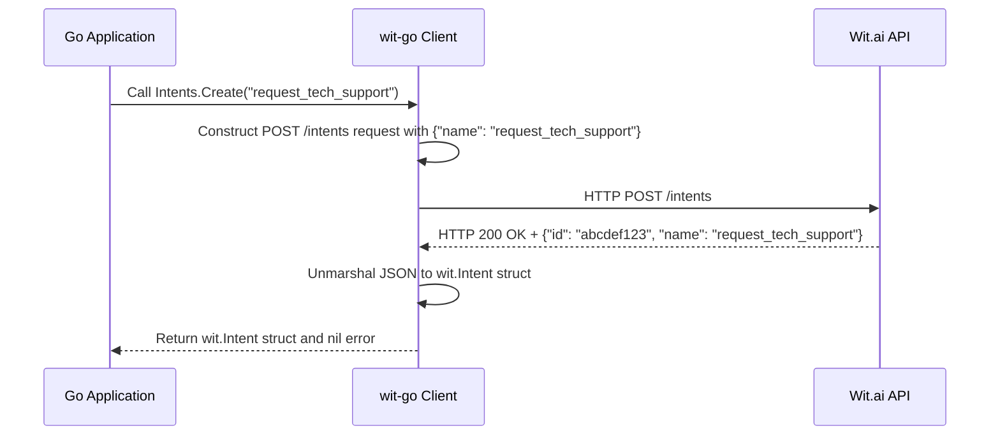

# Chapter 4: Intent Management

In the previous chapter, [Message Processing (NLU)](chapter_03.md), we explored how to send user input to Wit.ai and receive structured data, including identified *intents*. While the `wit-go` client can effectively extract existing intents, understanding and managing these core components is crucial for building robust and dynamic NLU applications. This chapter delves into how `wit-go` empowers you to programmatically define and refine the very goals your users express.

---

### Problem & Motivation

Imagine building a sophisticated customer support bot. Initially, it might handle simple queries like "track my order" or "reset password." As your product evolves or new services are introduced, you'll need your bot to understand new user requests, such as "request a refund" or "update my shipping address." Manually adding and configuring these new "intents" through the Wit.ai web interface for every change can be tedious, error-prone, and unsustainable, especially in a CI/CD environment.

This is the problem Intent Management solves within `wit-go`. It allows developers to define, update, and remove intents directly from their Go applications. This capability is vital for maintaining a scalable and easily configurable NLU system. It enables automated deployment of bot configurations, ensures consistency across environments, and allows your application's understanding capabilities to evolve alongside your business needs, without requiring human intervention for every minor adjustment.

---

### Core Concept Explanation

At the heart of Natural Language Understanding (NLU) in Wit.ai are **intents**. An *intent* represents the goal or purpose behind a user's utterance. When a user says "What's the weather like in Paris?", the underlying *intent* is likely `get_weather_forecast`. When they say "Order a pizza for me," the *intent* is `order_food`.

In essence, intents categorize what a user *wants to do* or *what information they are seeking*. They are the primary action identifiers that drive your application's logic. By accurately identifying the intent, your `wit-go` application knows which function to call or which part of its logic to execute. Managing these intents programmatically allows you to precisely control the vocabulary of actions your Wit.ai application understands, making your Go application dynamic and adaptive to changing user requirements or business rules. It's about giving your application the ability to "learn" new user goals on the fly.

---

### Practical Usage Examples

The `wit-go` client provides a set of methods under its `Intents` service to manage intents. Let's walk through common operations using our customer support bot example, where we might need to add, list, update, and delete intents.

First, ensure you have an initialized `wit.Client` instance, as discussed in [Wit.ai Client](chapter_01.md).

```go
package main

import (
	"context"
	"fmt"
	"log"
	"os"

	witai "github.com/wit-ai/wit-go/v2"
)

func main() {
	client := witai.NewClient(os.Getenv("WIT_AI_SERVER_ACCESS_TOKEN"))
	ctx := context.Background()

	// --- Example: Listing Intents ---
	fmt.Println("--- Listing all intents ---")
	// ... (code for listing intents below)
}
```

#### Listing All Intents

To see all the intents currently configured in your Wit.ai application, you can use the `List` method.

```go
	// In main() function...
	intents, err := client.Intents.List(ctx)
	if err != nil {
		log.Fatalf("Error listing intents: %v", err)
	}

	fmt.Printf("Found %d intents:\n", len(intents))
	for _, intent := range intents {
		fmt.Printf("- ID: %s, Name: %s\n", intent.ID, intent.Name)
	}
	fmt.Println("")
```
**Explanation:** This code snippet calls the `Intents.List` method, which queries the Wit.ai API and returns a slice of `wit.Intent` structs, each containing the `ID` and `Name` of an intent. It's useful for inspecting the current state of your NLU model.

#### Creating a New Intent

Let's say our customer support bot needs to handle requests for "technical support." We can add a new `request_tech_support` intent.

```go
	// In main() function...
	fmt.Println("--- Creating a new intent 'request_tech_support' ---")
	newIntentName := "request_tech_support"
	createdIntent, err := client.Intents.Create(ctx, newIntentName)
	if err != nil {
		// Handle specific error if intent already exists
		if witai.IsAPIError(err, witai.ErrCodeIntentAlreadyExists) {
			fmt.Printf("Intent '%s' already exists.\n", newIntentName)
		} else {
			log.Fatalf("Error creating intent '%s': %v", newIntentName, err)
		}
	} else {
		fmt.Printf("Created intent: ID=%s, Name=%s\n", createdIntent.ID, createdIntent.Name)
	}
	fmt.Println("")
```
**Explanation:** The `Intents.Create` method takes the desired intent name as a string. If successful, it returns a `wit.Intent` object representing the newly created intent, including its unique `ID`. We also include basic error handling for when the intent already exists.

#### Retrieving a Specific Intent

If you know the ID or name of an intent, you can fetch its details.

```go
	// In main() function...
	fmt.Println("--- Retrieving intent 'request_tech_support' by name ---")
	retrievedIntent, err := client.Intents.Get(ctx, newIntentName) // Can also use ID
	if err != nil {
		log.Fatalf("Error retrieving intent '%s': %v", newIntentName, err)
	}
	fmt.Printf("Retrieved intent: ID=%s, Name=%s\n", retrievedIntent.ID, retrievedIntent.Name)
	fmt.Println("")
```
**Explanation:** The `Intents.Get` method allows you to retrieve a single intent by its ID or name. This is useful for confirming an intent's existence or getting its precise ID for other operations.

#### Deleting an Intent

If an intent becomes obsolete (e.g., `track_old_system_order`), you can remove it. Be cautious, as this also removes associated utterances!

```go
	// In main() function...
	fmt.Println("--- Deleting intent 'request_tech_support' ---")
	// For demonstration, let's assume we want to delete the one we just created
	err = client.Intents.Delete(ctx, newIntentName) // Can also use ID
	if err != nil {
		if witai.IsAPIError(err, witai.ErrCodeIntentNotFound) {
			fmt.Printf("Intent '%s' not found for deletion.\n", newIntentName)
		} else {
			log.Fatalf("Error deleting intent '%s': %v", newIntentName, err)
		}
	} else {
		fmt.Printf("Successfully deleted intent '%s'.\n", newIntentName)
	}
	fmt.Println("")
```
**Explanation:** The `Intents.Delete` method takes the intent's ID or name and removes it from your Wit.ai application. It returns an error if the intent doesn't exist or if there's an API issue.

---

### Internal Implementation Walkthrough

The `wit-go` client's `Intents` service acts as a convenient wrapper around the Wit.ai API's intent endpoints. When you call methods like `Create`, `List`, `Get`, or `Delete`, the client performs the following steps:

1.  **Constructs the Request:** It builds the correct HTTP request URL (e.g., `/intents`, `/intents/{intentId}`) and payload (for `Create`).
2.  **Authenticates:** It adds the necessary `Authorization` header with your Wit.ai server access token. This token is configured during the client's initialization, as covered in [Client Configuration Options](chapter_02.md).
3.  **Sends HTTP Request:** It uses Go's `net/http` package to send the request to the Wit.ai API.
    *   `List`: `GET /intents`
    *   `Create`: `POST /intents` with a JSON body containing the intent name.
    *   `Get`: `GET /intents/{intentId}`
    *   `Delete`: `DELETE /intents/{intentId}`
4.  **Receives and Parses Response:** It waits for the API response, checks the HTTP status code, and then unmarshals the JSON response body into the appropriate `wit.Intent` or `[]wit.Intent` Go structs.
5.  **Error Handling:** If the API returns an error status code (e.g., 400, 401, 404), it wraps the API error into a Go error type that can be inspected by the calling application.

Here's a simplified sequence diagram for creating an intent:



The underlying code would primarily reside in a service file, perhaps `pkg/wit/intents.go`, making calls through the base client's `do` method.

---

### System Integration

Intent Management doesn't operate in a vacuum; it's a foundational component that interacts with several other parts of your `wit-go` application:

*   **[Wit.ai Client](chapter_01.md):** The `Intents` service is part of the main `wit.Client` object. All operations are performed through this client, ensuring proper authentication and connection to the Wit.ai API.
*   **[Message Processing (NLU)](chapter_03.md):** The intents you manage here are the very same intents that are detected and returned by Wit.ai during message processing. A well-defined set of intents directly improves the accuracy and utility of NLU results. If you process a message, and Wit.ai identifies an intent like `request_tech_support`, it's because you defined that intent using this management layer.
*   **[Utterance Management](chapter_06.md):** Intents are meaningless without examples of how users express them. `Utterance Management` is where you associate specific text phrases (utterances) with their corresponding intents. This "training data" teaches Wit.ai to recognize new user inputs and map them to the correct intent. You'll typically create an intent first, then add utterances that exemplify it.
*   **Entity Management (Next Chapter - [Entity Management](chapter_05.md)):** While intents define *what* a user wants to do, entities define the *details* of that action (e.g., "Paris" in `get_weather_forecast in Paris`). Intents often work in conjunction with entities to provide a complete understanding of user requests.

**Data Flow:**

1.  A developer uses `wit-go`'s Intent Management to `Create` a new intent (e.g., `schedule_meeting`).
2.  This intent is stored in the Wit.ai application.
3.  The developer then uses `wit-go`'s `Utterance Management` to `Add` utterances like "book a meeting for tomorrow" and links them to `schedule_meeting` intent.
4.  When a user says "Can you arrange a conference for next week?", `Message Processing (NLU)` sends this to Wit.ai.
5.  Wit.ai, having been trained with your utterances, identifies the `schedule_meeting` intent and possibly a `datetime` entity.
6.  Your `wit-go` application then uses this identified intent to trigger the appropriate backend logic.

---

### Best Practices & Tips

*   **Descriptive Naming:** Choose clear, concise, and consistent names for your intents (e.g., `get_weather`, `order_pizza`, `cancel_subscription`). Avoid ambiguity and overly generic names. Use `snake_case` for consistency.
*   **Idempotency:** When programmatically creating or updating intents in a deployment script, ensure your operations are idempotent. This means running the script multiple times won't create duplicate intents or cause errors. Always check if an intent exists before attempting to create it, or handle the "already exists" error gracefully.
*   **Granularity:** Aim for a reasonable level of granularity. Don't make intents too broad (e.g., `general_query`) or too specific (e.g., `order_small_pepperoni_pizza_for_delivery_at_7pm`). Combine similar user goals into one intent and use entities to capture the specific details.
*   **Version Control:** Treat your intent definitions (and related utterances and entities) as code. Store the Go code that manages them in your version control system (e.g., Git) to track changes, enable collaboration, and facilitate rollbacks.
*   **Error Handling:** Always implement robust error handling, especially for API calls. Check for network issues, API rate limits, and Wit.ai specific errors (e.g., `witai.IsAPIError`) to provide meaningful feedback or retry mechanisms.
*   **Training Data is Key:** Merely defining an intent isn't enough. You *must* follow up by providing ample and diverse training utterances using `Utterance Management` to teach Wit.ai how users express that intent. Without training, Wit.ai won't be able to detect your new intents.

---

### Chapter Conclusion

Intent Management is a critical capability in the `wit-go` project, providing the means to programmatically define and maintain the core understanding of your NLU application. By mastering the creation, retrieval, and deletion of intents, you gain the power to evolve your bot's capabilities dynamically, integrate NLU changes into your CI/CD pipelines, and ensure your application remains responsive to new user needs. This chapter has equipped you with the foundational knowledge and practical examples to effectively manage intents, setting the stage for building intelligent and adaptable `wit-go` applications.

With a solid grasp on managing the *goals* users express, our next step is to understand how to manage the *details* within those goals. Proceed to [Entity Management](chapter_05.md) to learn how to define and extract specific pieces of information from user utterances.