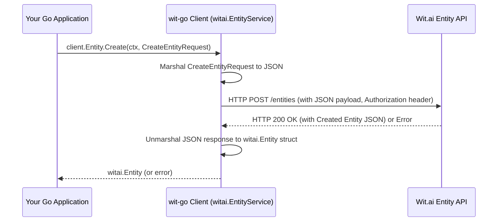

# Chapter 5: Entity Management

In the journey of building intelligent applications with Wit.ai, we've explored how to define user intentions through [Intent Management](chapter_04.md). However, understanding *what* a user wants to do is often only half the battle. To truly respond effectively, an application also needs to extract the *specific pieces of information* relevant to that intent. This is where **Entity Management** becomes indispensable.

---

### Problem & Motivation

Imagine building a food ordering application. A user might say, "I want to order two large pepperoni pizzas to 123 Main Street." While the intent is clearly `order_food`, the application needs to identify "two," "large," "pepperoni pizzas," and "123 Main Street" as crucial data points. Without a mechanism to reliably extract these details, the application cannot fulfill the order.

This is the core problem Entity Management solves: providing the tools to define, manage, and extract these vital pieces of information from unstructured user input. For the `wit-go` project, this abstraction empowers developers to programmatically configure their Wit.ai application to recognize and categorize the data points essential for their business logic, moving beyond just understanding the 'why' to grasping the 'what' and 'how'.

Throughout this chapter, we will use the concrete example of managing entities for a food ordering application, specifically defining an entity for `meal_item` and another for `delivery_address`, to illustrate the concepts and practical usage of the `wit-go` Entity Management client.

---

### Core Concept Explanation

At its heart, an **Entity** in Wit.ai represents a specific type of data or concept you want to extract from a user's utterance. Think of them as the nouns, adjectives, or phrases that provide context and details to an intent. For instance, if the intent is `order_drink`, entities might be `drink_type` (e.g., "coffee", "tea"), `size` (e.g., "large", "small"), or `quantity` (e.g., "two").

Wit.ai supports various types of entities, including:
*   **Keyword Entities**: Used for fixed sets of values (e.g., `topping` can be "pepperoni", "mushrooms", "olives"). They can also have synonyms.
*   **Free-Text Entities**: Designed to capture open-ended, non-predefined values (e.g., `delivery_address` or `product_name`). These often benefit from example utterances for Wit.ai to learn extraction patterns.
*   **System Entities**: Pre-built entities provided by Wit.ai for common concepts like dates, times, numbers, locations, and more (e.g., `wit/datetime`, `wit/number`).
*   **Trait Entities**: Special type of entity that represents a characteristic of the utterance rather than a specific data point. Often used for sentiment or affirmation/negation.

The `wit-go` client's Entity Management abstraction provides a straightforward way to interact with Wit.ai's entity API, allowing you to define these critical data extractors programmatically, ensuring your NLU model accurately identifies the granular details necessary for your application's logic.

---

### Practical Usage Examples

Let's apply our knowledge to the food ordering application. We'll demonstrate how to list, create, update, and delete entities using the `wit-go` client.

First, ensure you have initialized your Wit.ai client as discussed in [Chapter 1: Wit.ai Client](chapter_01.md).

```go
package main

import (
	"context"
	"fmt"
	"os"

	witai "github.com/wit-ai/wit-go/v2"
)

func main() {
	// Initialize the Wit.ai client with your server access token.
	// This token should be stored securely, e.g., as an environment variable.
	client := witai.NewClient(os.Getenv("WIT_AI_SERVER_ACCESS_TOKEN"))
	ctx := context.Background()

	// --- Entity Management Operations ---
	// Examples will follow in separate blocks
}
```
The above snippet sets up the basic client. All subsequent examples will assume this `client` and `ctx` are available.

#### 1. Listing All Entities

To get an overview of all entities currently defined in your Wit.ai application, you can use the `List` method.

```go
// List all entities in the Wit.ai application
entities, err := client.Entity.List(ctx)
if err != nil {
	fmt.Printf("Error listing entities: %v\n", err)
	return
}

fmt.Println("Existing Entities:")
for _, entity := range entities {
	fmt.Printf(" - %s (ID: %s)\n", entity.Name, entity.ID)
}
// Expected output might include system entities or any previously created custom entities.
// Example:
// Existing Entities:
//  - wit$location (ID: some-id-1)
//  - wit$datetime (ID: some-id-2)
```
This code block fetches and prints the names and IDs of all entities configured in your Wit.ai application, including any built-in system entities. It's a great way to inspect your NLU model's current data extraction capabilities.

#### 2. Creating a Custom Entity

Let's create a `meal_item` entity for our food ordering app, defined as a keyword entity with some initial values.

```go
// Define a new custom entity: meal_item (keyword entity)
newEntityName := "meal_item"
_, err = client.Entity.Create(ctx, witai.CreateEntityRequest{
	Name: newEntityName,
	Lookups: []witai.LookupType{
		witai.LookupTypeKeywords,
	},
	Keywords: []witai.EntityKeyword{
		{
			Keyword: "pizza",
			Synonyms: []string{"pie", "pizzas"},
		},
		{
			Keyword: "burger",
			Synonyms: []string{"hamburger", "sandwich"},
		},
	},
})
if err != nil {
	fmt.Printf("Error creating entity '%s': %v\n", newEntityName, err)
	return
}
fmt.Printf("Successfully created entity: %s\n", newEntityName)
// Expected output: Successfully created entity: meal_item
```
This example creates a new entity named `meal_item`. It's configured as a `keyword` lookup type and pre-populated with "pizza" and "burger" keywords, each having a few synonyms. This tells Wit.ai to look for these specific words in user input and label them as `meal_item`.

#### 3. Getting a Specific Entity's Details

After creating an entity, you might want to retrieve its full configuration, including all keywords and settings.

```go
// Get details for the newly created 'meal_item' entity
mealItemEntity, err := client.Entity.Get(ctx, newEntityName)
if err != nil {
	fmt.Printf("Error getting entity '%s': %v\n", newEntityName, err)
	return
}
fmt.Printf("Details for entity '%s':\n", mealItemEntity.Name)
for _, kw := range mealItemEntity.Keywords {
	fmt.Printf(" - Keyword: %s, Synonyms: %v\n", kw.Keyword, kw.Synonyms)
}
// Expected output:
// Details for entity 'meal_item':
//  - Keyword: pizza, Synonyms: [pie pizzas]
//  - Keyword: burger, Synonyms: [hamburger sandwich]
```
This code retrieves the `meal_item` entity by its name and then prints out its keywords and their associated synonyms, confirming the successful creation and configuration.

#### 4. Updating an Entity

Over time, you'll need to update entities, perhaps by adding more keywords or synonyms. Let's add "salad" to our `meal_item` entity.

```go
// Update the 'meal_item' entity to add a new keyword: salad
_, err = client.Entity.Update(ctx, newEntityName, witai.UpdateEntityRequest{
	Keywords: []witai.EntityKeyword{
		{
			Keyword: "pizza", // Existing keyword
			Synonyms: []string{"pie", "pizzas"},
		},
		{
			Keyword: "burger", // Existing keyword
			Synonyms: []string{"hamburger", "sandwich"},
		},
		{
			Keyword: "salad", // New keyword
			Synonyms: []string{"greens", "bowl"},
		},
	},
})
if err != nil {
	fmt.Printf("Error updating entity '%s': %v\n", newEntityName, err)
	return
}
fmt.Printf("Successfully updated entity: %s (added 'salad')\n", newEntityName)
// Expected output: Successfully updated entity: meal_item (added 'salad')
```
When updating, the entire `Keywords` array (and `Lookups` array) is replaced. Therefore, you must send all existing keywords along with any new ones. This snippet adds "salad" and its synonyms to the `meal_item` entity.

#### 5. Deleting an Entity

Finally, if an entity is no longer needed, it can be removed from your Wit.ai application.

```go
// Delete the 'meal_item' entity
err = client.Entity.Delete(ctx, newEntityName)
if err != nil {
	fmt.Printf("Error deleting entity '%s': %v\n", newEntityName, err)
	return
}
fmt.Printf("Successfully deleted entity: %s\n", newEntityName)
// Expected output: Successfully deleted entity: meal_item
```
This example shows how to delete the `meal_item` entity. It's a clean-up operation often performed when refining your NLU model or deprecating certain features.

---

### Internal Implementation Walkthrough

The `wit-go` client provides a clean Go-idiomatic interface over Wit.ai's RESTful API for entity management. The core logic resides within the `witai.EntityService` struct, which is accessed via `client.Entity`.

When you call a method like `client.Entity.Create(ctx, req)`, the following general steps occur:

1.  **Request Marshalling**: The `witai.CreateEntityRequest` struct, containing your entity definition, is marshalled into a JSON payload. This ensures the Go struct is correctly translated into the format expected by the Wit.ai API.
2.  **HTTP Request Construction**: An HTTP `POST` request (for creation) or `PUT` (for update), `GET` (for fetching), or `DELETE` (for deletion) is constructed to the appropriate Wit.ai `/entities` endpoint. The client adds necessary headers, including the authorization token (set during client initialization).
3.  **API Call**: The request is sent to the Wit.ai API.
4.  **Response Handling**: Upon receiving a response from Wit.ai, the client checks the HTTP status code. If it indicates an error (e.g., 4xx or 5xx), an error is returned.
5.  **Response Unmarshalling**: If the request was successful, the JSON response body is unmarshalled into the corresponding `witai.Entity` or `[]witai.Entity` Go struct, making the API response data easily accessible in your application.

Here's a simplified sequence diagram illustrating the `Create Entity` process:


The `wit-go` client abstracts away the complexities of HTTP requests, JSON serialization/deserialization, and error handling, providing a user-friendly Go interface that simplifies interaction with the Wit.ai platform. You can explore the `entity.go` file within the `wit-go` library for the precise implementation details of these operations.

---

### System Integration

Entity Management doesn't operate in a vacuum; it's deeply integrated with other core components of your Wit.ai application, particularly [Message Processing (NLU)](chapter_03.md) and [Intent Management](chapter_04.md).

*   **Integration with Message Processing (NLU)**: Once you define entities using the `wit-go` client, these definitions are reflected in your Wit.ai application. When a user sends an utterance for NLU processing via the `client.Message.Parse` method (from Chapter 3), Wit.ai uses your defined entities (alongside intents and built-in system entities) to extract relevant data. The NLU response will then include an `entities` array, detailing all identified entities, their values, and their confidence scores. This is where your programmatic entity definitions bear fruit, allowing your application to retrieve structured data from free-form text.

    ```go
    // Example conceptual integration:
    // User input: "Order me two large pizzas"
    // After processing with client.Message.Parse:
    // response.Intents[0].Name == "order_food"
    // response.Entities will contain:
    //   - wit$number: { value: 2 }
    //   - wit$quantity: { value: "large" } (if defined as a custom entity)
    //   - meal_item: { value: "pizzas" } (our custom entity!)
    ```

*   **Integration with Intent Management**: While entities focus on *what* data is extracted, intents focus on *why* the user is communicating. Often, certain entities are crucial for specific intents. For example, the `meal_item` entity is critical for the `order_food` intent. By defining both intents and entities, you build a robust NLU model that understands both the user's overarching goal and the specific details required to fulfill it. Training utterances (covered in [Utterance Management](chapter_06.md)) will link entities to intents, teaching Wit.ai how they relate in context.

The entities you manage programmatically directly influence the quality and granularity of the NLU output, which in turn drives the business logic of your `wit-go` powered application.

---

### Best Practices & Tips

To make the most of Wit.ai's Entity Management and the `wit-go` client, consider these best practices:

*   **Design Entities Carefully**: Before implementing, identify all crucial data points your application needs. Avoid creating overly broad entities or entities that overlap significantly in meaning. Clarity in entity definition leads to better extraction.
*   **Leverage System Entities**: Always check if a Wit.ai system entity (e.g., `wit/datetime`, `wit/number`, `wit/location`) already covers your needs. These are highly optimized and require no training. Use custom entities only when system entities are insufficient.
*   **Keyword vs. Free-Text**:
    *   Use **Keyword Entities** for finite, known sets of values (e.g., "small", "medium", "large" for `size`; "pizza", "burger", "salad" for `meal_item`). Remember to include common synonyms!
    *   Use **Free-Text Entities** for open-ended input that can't be predefined (e.g., `delivery_address`, `product_name` for a catalog of millions of items). These require more training data (utterances) for Wit.ai to learn extraction patterns.
*   **Naming Conventions**: Use clear, descriptive, lowercase names for your entities (e.g., `meal_item` instead of `foodthing`). This improves readability and maintainability.
*   **Iterative Refinement**: Entity extraction isn't perfect from day one. Continuously monitor your NLU logs, identify missed or incorrectly extracted entities, and update your entity definitions (adding keywords, synonyms, or adjusting lookup types) as needed.
*   **Avoid Redundancy**: Don't create multiple entities for the same concept if one can be made robust enough.
*   **Consider Entity Roles**: For advanced scenarios, Wit.ai allows you to define "roles" for entities (e.g., two `wit/location` entities, one as `origin` and one as `destination`). While `wit-go` supports defining entities, understanding roles helps in designing complex NLU.

---

### Chapter Conclusion

This chapter has provided a comprehensive look into **Entity Management** within the `wit-go` project. We've understood that entities are the fundamental building blocks for extracting specific, actionable data from user utterances, moving beyond just understanding user intent. You've learned how the `wit-go` client simplifies the programmatic creation, retrieval, updating, and deletion of custom entities, enabling your application to precisely identify key pieces of information.

By effectively managing entities, you empower your Wit.ai application to respond intelligently and accurately to user requests, turning natural language into structured data your application can act upon. The next crucial step in building a robust NLU model is providing Wit.ai with diverse examples of how users express their intentions and provide entity details. This leads us directly to the next chapter: [Utterance Management](chapter_06.md), where we will explore how to manage the training phrases that teach Wit.ai to understand your users.