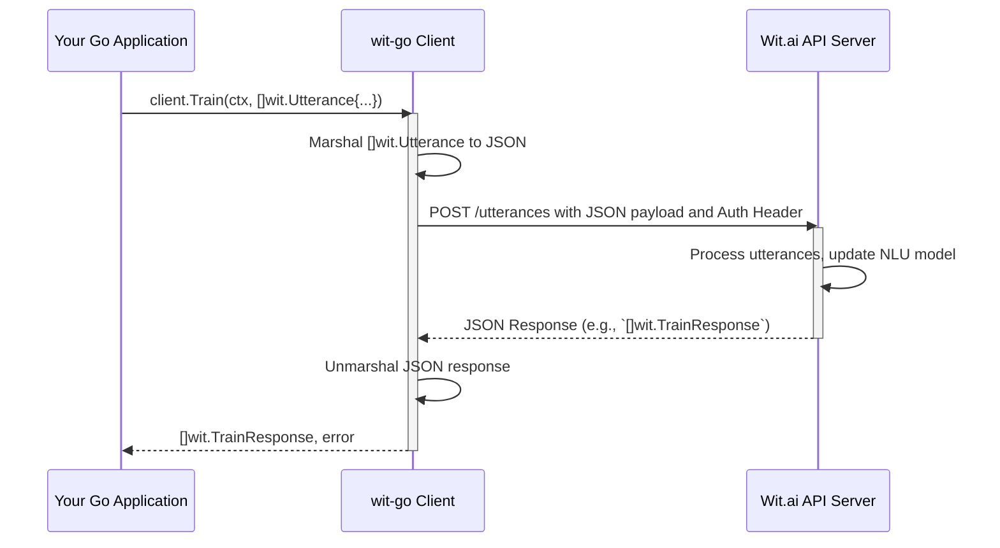

# Chapter 6: Utterance Management

Welcome to Chapter 6 of the `wit-go` documentation! In the previous chapter, [Entity Management](chapter_05.md), we learned how to define and manage the critical pieces of information Wit.ai extracts from user messages. Now that we understand how to structure the 'what' (entities) and the 'why' (intents, from [Intent Management](chapter_04.md)), it's time to teach our Wit.ai application *how* to recognize them within actual user phrases. This is where Utterance Management comes into play.

---

### Problem & Motivation

Imagine you're building a smart home application that controls lights. You've already defined an intent like `toggle_light` and entities such as `wit/on_off` (for 'on' or 'off') and `light_location` (for 'living room', 'kitchen'). However, without any examples, Wit.ai doesn't know *how* a user might express the desire to toggle lights or where. How does it learn that "Turn on the living room lights" should trigger the `toggle_light` intent with `wit/on_off` as 'on' and `light_location` as 'living room'?

This is the problem Utterance Management solves. Wit.ai's Natural Language Understanding (NLU) capabilities are driven by examples. The more relevant and diverse examples you provide, the smarter your application becomes at understanding user input. Without a robust set of utterances, your Wit.ai application will struggle to interpret even slightly varied phrases, leading to a poor user experience. It's the critical step where you bridge your conceptual model (intents and entities) with real-world language.

---

### Core Concept Explanation

An **utterance** is essentially an example phrase that you provide to Wit.ai, explicitly showing it what intent that phrase represents and what entities it contains. Think of it as providing flashcards to a student: on one side is the user's sentence, and on the other are the correct labels (intent and entities). By analyzing many such examples, Wit.ai learns patterns, allowing it to generalize and understand new, unseen phrases.

The process involves defining a piece of text (the user's phrase) and then annotating it with the corresponding intent and any relevant entities, specifying their exact positions within the text. For instance, the utterance "Turn off the kitchen lights" would be labeled with the `toggle_light` intent. It would also highlight "off" as a `wit/on_off` entity and "kitchen" as a `light_location` entity. The `wit-go` library streamlines the submission of these training examples to your Wit.ai application, making it straightforward to build and refine your NLU model programmatically.

The quality and diversity of your utterances directly impact the accuracy of your Wit.ai application. A well-trained application can handle synonyms, slight variations in phrasing, and even some grammatical errors because it has learned from a broad spectrum of examples. Utterances are the cornerstone of teaching your Wit.ai application to understand the nuances of human language.

---

### Practical Usage Examples

Let's revisit our smart home light control scenario. We want to train our Wit.ai application to understand the phrase "Turn on the living room lights." We need to define an utterance that maps this text to our `toggle_light` intent and extracts the 'on' state and 'living room' location.

First, ensure you have your `wit.Client` initialized as shown in [Chapter 1: Wit.ai Client](chapter_01.md).

```go
package main

import (
	"context"
	"fmt"
	"log"
	"os"

	"github.com/wit-go/wit-go/wit"
)

func main() {
	// Initialize the Wit.ai client
	// It's recommended to load your Wit.ai server access token from an environment variable
	witToken := os.Getenv("WIT_AI_SERVER_ACCESS_TOKEN")
	if witToken == "" {
		log.Fatal("WIT_AI_SERVER_ACCESS_TOKEN environment variable not set")
	}

	client := wit.NewClient(witToken)
	ctx := context.Background()

	// 1. Define an utterance
	// This structure maps a phrase to an intent and extracts specific entities.
	utterance := wit.Utterance{
		Text:   "Turn on the living room lights",
		Intent: "toggle_light", // The intent this utterance trains
		Entities: []wit.UtteranceEntity{
			{
				Entity: "wit/on_off:on_off", // System entity for on/off states
				Start:  5,                 // 'on' starts at index 5
				End:    7,                 // 'on' ends at index 7
				Body:   "on",              // The specific text body for the entity
				Value:  "on",              // The resolved value for the entity
			},
			{
				Entity: "light_location:light_location", // Your custom entity for locations
				Start:  16,                              // 'living room' starts at index 16
				End:    27,                              // 'living room' ends at index 27
				Body:   "living room",                   // The specific text body for the entity
				Value:  "living room",                   // The resolved value for the entity
			},
		},
	}

	// 2. Submit the utterance for training
	// We can submit multiple utterances at once using a slice.
	trainResponse, err := client.Train(ctx, []wit.Utterance{utterance})
	if err != nil {
		log.Fatalf("Failed to train utterances: %v", err)
	}

	// 3. Process the training response
	// The response will indicate success or highlight any issues.
	fmt.Println("Utterances submitted for training:")
	for _, res := range trainResponse {
		fmt.Printf("  Utterance: \"%s\" (Status: %s)\n", res.Text, res.Outcome)
		if res.Outcome != "success" {
			fmt.Printf("    Error: %s\n", res.Error)
		}
	}
	// Expected Output (if successful):
	// Utterances submitted for training:
	//   Utterance: "Turn on the living room lights" (Status: success)
}
```
This example defines a `wit.Utterance` structure. The `Text` field holds the raw phrase. `Intent` specifies the associated intent (which must already exist, either custom or built-in). The `Entities` slice contains `wit.UtteranceEntity` structures, each detailing an entity found in the `Text`: its name (e.g., `wit/on_off:on_off`), its start and end character indices, and the actual `Body` and `Value` it extracts. Finally, `client.Train` sends this data to Wit.ai.

You can submit multiple utterances in a single call to `client.Train`. This is efficient for batch updates to your training data.

```go
// ... (client initialization code) ...

func main() {
	witToken := os.Getenv("WIT_AI_SERVER_ACCESS_TOKEN")
	if witToken == "" {
		log.Fatal("WIT_AI_SERVER_ACCESS_TOKEN environment variable not set")
	}
	client := wit.NewClient(witToken)
	ctx := context.Background()

	// Define multiple utterances
	utterances := []wit.Utterance{
		{
			Text:   "Turn on the living room lights",
			Intent: "toggle_light",
			Entities: []wit.UtteranceEntity{
				{Entity: "wit/on_off:on_off", Start: 5, End: 7, Body: "on", Value: "on"},
				{Entity: "light_location:light_location", Start: 16, End: 27, Body: "living room", Value: "living room"},
			},
		},
		{
			Text:   "Switch off kitchen lamp",
			Intent: "toggle_light",
			Entities: []wit.UtteranceEntity{
				{Entity: "wit/on_off:on_off", Start: 7, End: 10, Body: "off", Value: "off"},
				{Entity: "light_location:light_location", Start: 11, End: 18, Body: "kitchen", Value: "kitchen"},
			},
		},
		{
			Text:   "Is the bedroom light on?",
			Intent: "query_light_status", // Assuming you have this intent
			Entities: []wit.UtteranceEntity{
				{Entity: "light_location:light_location", Start: 7, End: 14, Body: "bedroom", Value: "bedroom"},
				{Entity: "wit/on_off:on_off", Start: 20, End: 22, Body: "on", Value: "on"},
			},
		},
	}

	trainResponse, err := client.Train(ctx, utterances)
	if err != nil {
		log.Fatalf("Failed to train utterances: %v", err)
	}

	fmt.Println("Batch utterances submitted for training:")
	for _, res := range trainResponse {
		fmt.Printf("  Utterance: \"%s\" (Status: %s)\n", res.Text, res.Outcome)
		if res.Outcome != "success" {
			fmt.Printf("    Error: %s\n", res.Error)
		}
	}
	// Expected Output (if successful for all):
	// Batch utterances submitted for training:
	//   Utterance: "Turn on the living room lights" (Status: success)
	//   Utterance: "Switch off kitchen lamp" (Status: success)
	//   Utterance: "Is the bedroom light on?" (Status: success)
}
```
This batch example demonstrates how to efficiently train your Wit.ai application with multiple examples, improving its understanding of various user requests for light control. The response iterates through each submitted utterance, indicating its training outcome.

---

### Internal Implementation Walkthrough

The `Utterance Management` abstraction in `wit-go` primarily revolves around the `Client.Train` method. When you invoke `client.Train`, here's a simplified look at what happens internally:

1.  **Request Marshalling**: The `wit-go` client takes the `[]wit.Utterance` slice you provide. Each `wit.Utterance` struct is then marshaled into a JSON object according to Wit.ai's API specifications. This JSON array represents the collection of training examples.
2.  **API Call**: The client constructs an HTTP `POST` request to the Wit.ai API's `/utterances` endpoint. The marshaled JSON array forms the body of this request. Crucially, the client ensures the `Authorization` header includes your server access token (set during client initialization).
3.  **Response Handling**: Upon receiving a response from the Wit.ai API, the `wit-go` client unmarshals the JSON response body into a `[]wit.TrainResponse` slice. This response indicates the outcome for each submitted utterance, whether it was successfully processed, or if there were any errors (e.g., due to an invalid intent or entity reference).
4.  **Error Propagation**: If the HTTP request itself fails (e.g., network error, invalid authentication), or if unmarshalling the response fails, an error is returned directly. Otherwise, the `[]wit.TrainResponse` is returned, allowing you to inspect the individual results.

This process ensures that your training data is correctly formatted and securely transmitted to Wit.ai, and that you receive clear feedback on the training operation.



The `wit.Client` object (from `client.go`) provides the `Train` method, which encapsulates this entire interaction with the `/utterances` endpoint. The `wit` package's `utterance.go` file defines the `Utterance` and `UtteranceEntity` structs that map directly to Wit.ai's required data structure for training examples.

---

### System Integration

Utterance Management is deeply integrated with other core abstractions within the Wit.ai ecosystem, and thus, within the `wit-go` project:

*   **[Intent Management](chapter_04.md)**: Every utterance *must* be associated with an intent. Before you can submit an utterance like "Turn on the living room lights" with the intent `toggle_light`, that `toggle_light` intent must already exist in your Wit.ai application. If it doesn't, Wit.ai will reject the utterance, and `client.Train` will return an error or a `TrainResponse` with a failure status.
*   **[Entity Management](chapter_05.md)**: Similarly, any custom entities you annotate within an utterance (e.g., `light_location`) must also be defined in your Wit.ai application beforehand. Utterances provide concrete examples of how these entities appear in natural language, which helps Wit.ai learn to extract them reliably. Even built-in entities like `wit/on_off` are referenced by their canonical name.
*   **[Message Processing (NLU)](chapter_03.md)**: The ultimate goal of training with utterances is to improve the accuracy of message processing. Once you've trained your application with a good set of utterances, sending new user input via `client.Message` should yield accurate intent and entity extraction, reflecting the patterns learned from your training data.

The data flow is sequential: you define intents and entities, then create utterances that leverage these definitions, and finally, your NLU model uses this training to process live user messages.

---

### Best Practices & Tips

To maximize the effectiveness of your Wit.ai application's NLU, consider these best practices when managing utterances:

1.  **Diversity is Key**: Don't just provide slight variations of the same phrase. Offer a wide range of sentence structures, synonyms, and ways users might express the same intent. For "Turn on the lights," also consider "Switch on the lamps," "Can you put the light on," "Activate the illumination," etc.
2.  **Start Small, Iterate Often**: Begin with 5-10 diverse utterances per intent, and then iteratively add more as you encounter new user phrases or observe NLU errors. This agile approach helps you refine your model continuously.
3.  **Avoid Ambiguity**: Ensure each utterance clearly maps to a single intent. If a phrase could mean two different things, consider if your intents are well-defined or if you need to add context-specific entities.
4.  **Use Canonical Entity Values**: For custom entities, always annotate with consistent `Value`s, even if the `Body` (the actual text in the utterance) varies. For example, "kitchen" and "the kitchen" might both have a `Value` of "kitchen" for a `light_location` entity.
5.  **Test Regularly**: After adding new utterances, test your application with new, unseen phrases to gauge the improvement in NLU accuracy. This helps identify gaps in your training data.
6.  **Review Training Feedback**: Pay attention to the `Outcome` and `Error` fields in the `TrainResponse`. These can highlight issues like non-existent intents/entities or other API-related problems.
7.  **Keep Utterances Realistic**: Use phrases that real users would actually say, rather than perfectly grammatically correct or overly formal sentences.

---

### Chapter Conclusion

Utterance Management is the engine that drives your Wit.ai application's understanding. By providing a rich and diverse set of annotated examples, you empower your application to accurately interpret user intent and extract crucial information, bridging the gap between human language and machine comprehension. The `wit-go` library provides a robust and easy-to-use interface for programmatically managing these vital training examples.

With a solid understanding of how to manage utterances, you're well-equipped to build intelligent applications that truly understand what your users are saying. In the next chapter, we'll delve into [Dictation (Speech-to-Text)](chapter_07.md), exploring how `wit-go` facilitates converting spoken language into text that can then be processed by the NLU engine we've trained.

---
**Complete Tutorial Structure:**
1. [Wit.ai Client](chapter_01.md)
2. [Client Configuration Options](chapter_02.md)
3. [Message Processing (NLU)](chapter_03.md)
4. [Intent Management](chapter_04.md)
5. [Entity Management](chapter_05.md)
6. [Utterance Management](chapter_06.md)
7. [Dictation (Speech-to-Text)](chapter_07.md)