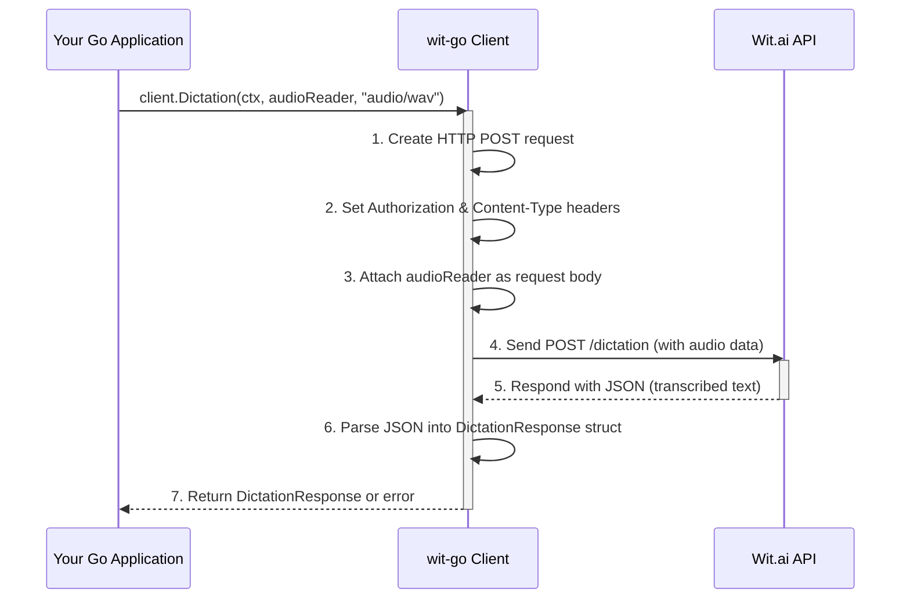

# Chapter 7: Dictation (Speech-to-Text)

Having explored how to manage example phrases and train your Wit.ai application using [Utterance Management](chapter_06.md), we now turn our attention to how users typically interact with voice-enabled systems: through spoken words. While previous chapters focused on processing or managing *textual* input, real-world applications often need to understand *audio* input first.

---

### Problem & Motivation

In an increasingly voice-first world, users expect to interact with applications using their natural voice. Typing commands or messages isn't always convenient or possible, especially when hands are occupied, or accessibility is a concern. For instance, imagine a smart home assistant where you simply say, "Turn off the lights in the living room," or a mobile app where you dictate a message instead of typing it. The fundamental problem here is bridging the gap between spoken audio and the textual data that Natural Language Understanding (NLU) systems, like Wit.ai, can process.

This is precisely the problem that the Dictation (Speech-to-Text) abstraction in `wit-go` solves. It empowers your Go applications to accept audio input from users and convert it into text. This text can then be fed into Wit.ai's NLU engine for further processing, allowing your application to extract intents and entities from spoken commands or queries. Without this capability, your 'wit-go' powered application would be limited to keyboard input, missing a crucial interaction paradigm for modern, intelligent systems.

Consider our smart home assistant use case: a user speaks into a microphone, and the audio needs to be converted to text before the NLU can determine the intent (`turn_off_lights`) and entities (`living_room`). This Dictation feature is the critical first step in enabling such seamless voice interactions.

---

### Core Concept Explanation

Dictation, in the context of Wit.ai and `wit-go`, refers specifically to the process of **Speech-to-Text (STT)**. It's the technology that transforms human speech, captured as an audio signal, into written text. This transformation is vital because Wit.ai's NLU capabilities primarily operate on textual input.

The process typically involves:
1.  **Audio Capture**: Your application records or receives audio data from a microphone or an audio file.
2.  **Audio Encoding**: This raw audio needs to be encoded in a format that Wit.ai understands (e.g., `audio/mpeg`, `audio/wav`, `audio/raw`). Key parameters here are the *sampling rate* (how many audio samples per second) and the *encoding* (e.g., signed 16-bit PCM).
3.  **Transmission to Wit.ai**: The encoded audio is sent to the Wit.ai API endpoint designated for speech processing.
4.  **Speech Recognition**: Wit.ai's powerful models analyze the audio, recognizing phonemes, words, and context to transcribe the speech into text.
5.  **Textual Output**: Wit.ai returns the transcribed text, which your `wit-go` application then receives and can use for subsequent NLU processing.

The `wit-go` library simplifies this by providing methods that handle the complexities of sending audio data to Wit.ai, ensuring proper headers and content types are used. It acts as an intermediary, taking your audio input and returning the transcribed text, making the robust STT capabilities of Wit.ai easily accessible within your Go application development workflow.

---

### Practical Usage Examples

Let's use our smart home assistant example where a user says, "Turn on the kitchen lights." We'll simulate sending an audio file containing this phrase for dictation.

First, ensure you have a `wit.Client` instance initialized.

```go
package main

import (
	"context"
	"fmt"
	"os"

	witai "github.com/wit-ai/wit-go/v2" // Assuming v2 for the latest client structure
)

func main() {
	// Initialize the Wit.ai client
	// Replace "YOUR_WIT_AI_SERVER_ACCESS_TOKEN" with your actual token
	client := witai.NewClient(witai.Config{
		ServerAccessToken: os.Getenv("WIT_AI_SERVER_ACCESS_TOKEN"),
	})

	// ... rest of the code
}
```
*Initialization:* This snippet shows the essential first step: creating a `wit.Client`. This client will manage authentication and communication with the Wit.ai API. It's crucial for all interactions, including dictation.

Now, let's process an audio file for speech-to-text. For this example, imagine you have an audio file named `audio.wav` containing the spoken phrase "Turn on the kitchen lights."

```go
	// Path to your audio file (e.g., "turn_on_kitchen_lights.wav")
	// For demonstration, assume this file exists and contains spoken input
	audioFilePath := "path/to/your/audio.wav" // Replace with a real audio file path
	audioFile, err := os.Open(audioFilePath)
	if err != nil {
		fmt.Printf("Error opening audio file: %v\n", err)
		return
	}
	defer audioFile.Close()

	// Perform Dictation (Speech-to-Text)
	fmt.Printf("Sending audio file '%s' for dictation...\n", audioFilePath)
	resp, err := client.Dictation(context.Background(), audioFile, "audio/wav")
	if err != nil {
		fmt.Printf("Error during dictation: %v\n", err)
		return
	}

	// Print the transcribed text
	fmt.Println("Dictation Result:")
	fmt.Printf("Text: %s\n", resp.Text)
	fmt.Printf("Speech: %s\n", resp.Speech)
}
```
*Dictation Request:* Here, `client.Dictation` is called with the audio file and its MIME type. `context.Background()` provides a default context for the operation. The function sends the audio data to Wit.ai and returns the transcription result.

*Expected Output (example):*
```
Sending audio file 'path/to/your/audio.wav' for dictation...
Dictation Result:
Text: Turn on the kitchen lights
Speech: Turn on the kitchen lights
```
*Interpreting the Response:* The `resp.Text` field will contain the transcribed text from the audio input. `resp.Speech` often contains similar or identical information for direct speech content. This text output is now ready for further NLU processing.

---

### Internal Implementation Walkthrough

The `Dictation` method in `wit-go` provides a high-level abstraction over the underlying HTTP API call to Wit.ai's `/dictation` endpoint. When you call `client.Dictation(ctx, audioReader, contentType)`, several actions occur internally:

1.  **Prepare HTTP Request**: The client constructs an `http.Request`. It sets the HTTP method to `POST`.
2.  **Set Headers**:
    *   The `Authorization` header is set using your `ServerAccessToken`.
    *   The `Content-Type` header is crucial and is set to the `contentType` string you provide (e.g., `"audio/wav"`, `"audio/mpeg"`). This tells Wit.ai what kind of audio data to expect.
    *   Other headers like `X-Wit-AI-V` (API version) might also be set based on client configuration.
3.  **Attach Audio Body**: The `audioReader` (an `io.Reader`) is used as the body of the `POST` request. This allows `wit-go` to stream the audio data directly from a file or any other source implementing `io.Reader`, avoiding the need to load the entire audio into memory for large files.
4.  **Send Request**: The `http.Client` associated with `wit-go` client sends this prepared request to `https://api.wit.ai/dictation`.
5.  **Receive Response**: Wit.ai processes the audio, transcribes it, and sends back an `application/json` response containing the transcribed text.
6.  **Parse Response**: `wit-go` reads the JSON response body and unmarshals it into a `DictationResponse` struct. This struct typically includes fields like `Text` and `Speech`.
7.  **Error Handling**: If an error occurs during any of these steps (network issues, invalid audio format, Wit.ai API errors), `wit-go` wraps the underlying error and returns it to your application.

Here's a simplified sequence diagram illustrating the internal flow:



This sequence highlights how `wit-go` acts as a crucial layer, abstracting the raw HTTP communication, ensuring correct protocol usage, and presenting the result in a convenient Go struct.

---

### System Integration

The primary purpose of Dictation is to serve as the initial processing step for spoken input before it can be understood by the Natural Language Understanding (NLU) components of Wit.ai. This creates a critical pipeline for voice-enabled applications:

1.  **Audio Input**: A user speaks, and the application captures audio (e.g., from a microphone).
2.  **Dictation (Speech-to-Text)**: The `wit-go` client's `Dictation` method converts this audio into a text string.
3.  **Message Processing (NLU)**: The resulting text string is then passed to the [Message Processing (NLU)](chapter_03.md) abstraction.
4.  **Intent & Entity Extraction**: Wit.ai's NLU analyzes the text to identify the user's [Intent Management](chapter_04.md) (e.g., `turn_on_lights`) and extract relevant [Entity Management](chapter_05.md) (e.g., `location: kitchen`).
5.  **Application Logic**: Your Go application then uses these extracted intents and entities to perform the desired action (e.g., send a command to smart lights).

This seamless flow is crucial for conversational AI applications. The Dictation component effectively bridges the auditory world of the user with the linguistic processing world of Wit.ai, making `wit-go` a comprehensive solution for voice interfaces.

```mermaid
graph TD
    A[User Speaks Audio] --> B(Application Captures Audio)
    B --> C{wit-go Dictation (STT)}
    C -- Transcribed Text --> D{wit-go Message Processing (NLU)}
    D -- Intents & Entities --> E(Application Logic)
    E --> F[Perform Action / Respond]
    F -- Audio Response (TTS, Optional) --> A
```

This diagram illustrates how Dictation (`C`) is an essential precursor to NLU (`D`), forming a complete voice-to-action pipeline.

---

### Best Practices & Tips

To get the most out of `wit-go`'s Dictation capabilities, consider the following best practices:

*   **Supported Audio Formats**: Always refer to the official Wit.ai documentation for the most up-to-date list of supported audio formats and their optimal parameters (e.g., sampling rates, encoding). Common formats include `audio/wav` (PCM), `audio/mpeg` (MP3), and `audio/opus`. Providing the correct `Content-Type` header is crucial for Wit.ai to correctly interpret the audio.
*   **Audio Quality**: The accuracy of speech-to-text is highly dependent on the quality of the input audio. Minimize background noise, use high-quality microphones, and ensure clear speech for best results.
*   **Streaming vs. Files**: The `Dictation` method accepts an `io.Reader`, which means you can stream audio directly from a microphone input without saving it to a temporary file. This is generally more efficient for real-time applications. For pre-recorded audio, an `os.File` (which implements `io.Reader`) is convenient.
*   **Error Handling**: Always implement robust error handling around `client.Dictation`. Network issues, malformed audio, or Wit.ai API errors can occur. Check the `err` return value and handle different error types gracefully.
*   **Context for Long Audio**: For longer audio segments, consider using a `context.WithTimeout` to prevent requests from hanging indefinitely, especially in interactive applications. Wit.ai also has limits on audio duration per request.
*   **Security**: Ensure your `WIT_AI_SERVER_ACCESS_TOKEN` is securely stored and accessed, ideally via environment variables or a secure configuration management system, as shown in the examples.

---

### Chapter Conclusion

This chapter has provided a comprehensive look into the Dictation (Speech-to-Text) capabilities offered by the `wit-go` library. We've seen how it tackles the fundamental challenge of converting spoken language into text, opening up your Go applications to voice-driven interactions. By understanding its core concepts, practical usage, internal workings, and integration within the broader Wit.ai ecosystem, you are now equipped to build sophisticated, voice-enabled applications.

The `wit-go` client, through its abstractions like Dictation and Message Processing, makes the powerful features of Wit.ai accessible and manageable for Go developers. From handling user input, whether typed or spoken, to managing the very fabric of your NLU models (Intents, Entities, Utterances), `wit-go` provides a complete toolkit. This concludes our journey through the `wit-go` project documentation. You now possess the knowledge to leverage Wit.ai's capabilities to build intelligent, conversational experiences with ease.