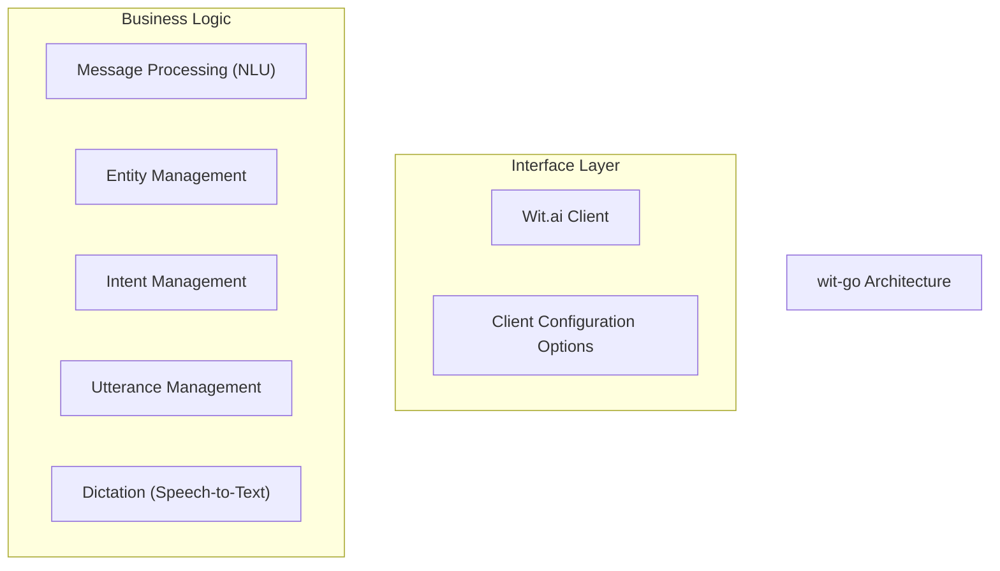
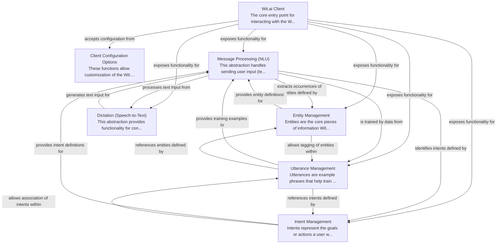

# wit-go Tutorial

Welcome to the comprehensive tutorial for wit-go. This tutorial is automatically generated from the codebase to help you understand the core concepts and implementation patterns.

## Project Overview

The 'wit-go' project provides an official Go client library for the Wit.ai API.
It simplifies the integration of Wit.ai's natural language understanding (NLU) and
speech-to-text (STT) services into Go applications. Developers can leverage it to
send user input for processing, manage application training data, and configure
client behavior.

## System Architecture

## Component Relationships

## Table of Contents

1. [Chapter 1: Wit.ai Client](chapter_01.md) - Comprehensive documentation for Wit.
2. [Chapter 2: Client Configuration Options](chapter_02.md) - Comprehensive documentation for Client Configuration Options following structured methodology...
3. [Chapter 3: Message Processing (NLU)](chapter_03.md) - Comprehensive documentation for Message Processing (NLU) following structured methodology...
4. [Chapter 4: Intent Management](chapter_04.md) - Comprehensive documentation for Intent Management following structured methodology...
5. [Chapter 5: Entity Management](chapter_05.md) - Comprehensive documentation for Entity Management following structured methodology...
6. [Chapter 6: Utterance Management](chapter_06.md) - Comprehensive documentation for Utterance Management following structured methodology...
7. [Chapter 7: Dictation (Speech-to-Text)](chapter_07.md) - Comprehensive documentation for Dictation (Speech-to-Text) following structured methodology...

## How to Use This Tutorial

1. **Start with Chapter 1** to understand the foundational concepts
2. **Follow the sequence** - each chapter builds upon previous concepts
3. **Practice with code examples** - every chapter includes practical examples
4. **Refer to diagrams** - use architecture diagrams for visual understanding
5. **Cross-reference concepts** - chapters link to related topics

## Tutorial Features

- **Progressive Learning**: Concepts are introduced in logical order
- **Code Examples**: Every chapter includes practical, executable code
- **Visual Diagrams**: Mermaid diagrams illustrate complex relationships
- **Cross-References**: Easy navigation between related concepts
- **Beginner-Friendly**: Written for newcomers to the codebase

## Contributing

This tutorial is auto-generated from the codebase. To improve it:
1. Update the source code documentation
2. Add more detailed comments to key functions
3. Regenerate the tutorial using the documentation system

---

*Generated using AI-powered codebase analysis*
